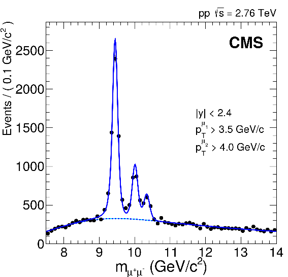
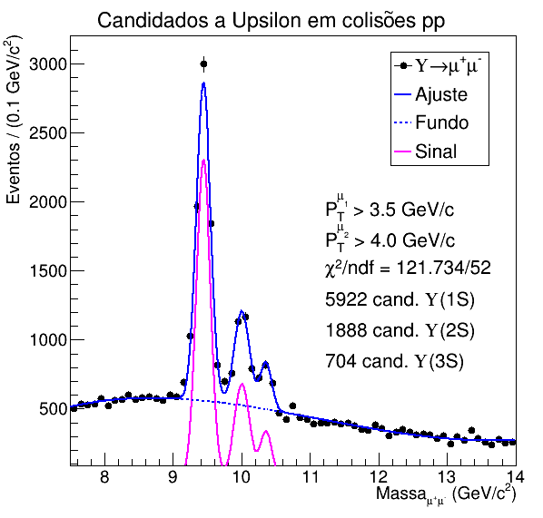

# Introdução à Análise de Dados do Méson Upsilon

> A partir dos dados públicos de colisões pp no LHC disponibilizados pela colaboração CMS, o código monta um histograma para massa invariante dos pares de múons com o objetivo de indentificar os três estados do méson-upsilon e ajustar uma função sobre.

## Importante!

Embora o código também tenha sua parte para analisar os dados da colisão chumbo-chumbo (PbPb), elas não se encontram finalizadas!!!

## Arquivos necessários

Os dados a serem analisados serão dos arquivos:
* [upsilonTree_2p76TeV_pp_data.root](https://drive.google.com/file/d/1XdR4lrdKjNMJxd3rnT2m8bnrrnZbP2q1/view?usp=sharing) ([link alternativo](https://indico.kfki.hu/event/368/sessions/183/attachments/529/995/upsilonTree_2p76TeV_pp_data.root))
* [upsilonTree_2p76TeV_PbPb_data.root](https://drive.google.com/file/d/1NRuD2kyMdx-v_hbOU-HMuSNS24Gtfh5K/view?usp=sharing) ([link alternativo](https://indico.kfki.hu/event/368/sessions/183/attachments/529/996/upsilonTree_2p76TeV_PbPb_data.root))

Os arquivos extras e mais podem ser encontrados no google drive [clicando aqui](https://drive.google.com/drive/folders/1DBPiqTYC6yJUPc9688nM8Azrw3UIo_YV) ([ou aqui](https://indico.kfki.hu/event/368/sessions/183/))!
Note que os dados `PbPb` não estão sendo utilizados, pois o código está comentado nesta análise.

## Configuração de desenvolvimento

É necessário ter o [ROOT](https://root.cern.ch/root/html534/guides/users-guide/InstallandBuild.html), software do CERN, com o `cmake` instalado na sua máquina para rodar o código.

Vá na pasta onde se encontra os arquivos baixados pelo terminal e digite:

```sh
$ root -l -n
root[0] .x exercicio1.C
```

Um arquivo `InvariantMasspp.png` aparecerá na pasta com o histograma gerado e também surgirá na sua tela.

## Referência

Imagem de referência disponível no artigo [Observation of sequential Upsilon suppression in PbPb collisions](https://arxiv.org/abs/1208.2826).



## Exemplo de uso

Com o código e os arquivos fornecidos, cconseguimos este resultado.


